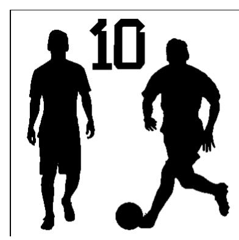

# Relatório do Trabalho prático
# Comunicação e Visualização de Informação

## <word cloud messi>
## <W.C.M>

## Aluno: LUCAS LOPE$>, 1711299 
## 2024-25_1711299_cvi   lucasevora027@email.com

### 1-Descrição do Trabalho
Este trabalho consistiu na realização de um projeto integrado envolvendo design gráfico, redação e programação. Inicialmente, foi criada uma máscara personalizada no Google Drawings, com o objetivo de servir como elemento visual para o projeto. Em seguida, foi elaborado um mini texto destacando as principais características do jogador Lionel Messi, como sua habilidade, precisão e velocidade. Esses dois componentes foram então incorporados em um código Python, utilizando bibliotecas específicas para manipulação e exibição gráfica, demonstrando a integração entre elementos visuais, textuais e computacionais. O trabalho explorou habilidades criativas e técnicas, aplicando-as em um contexto interdisciplinar.

### 2-Arquitectura do trabalho

### 3-Descrição da implementação	
 Utilizei o Google Drawings para criar uma máscara gráfica personalizada, ajustando detalhes para destacar seu design. Em seguida, desenvolvi um mini texto descrevendo as características do jogador Lionel Messi, incluindo sua habilidade técnica, velocidade e precisão. Posteriormente, implementei tanto a máscara quanto o texto em um código Python, integrando os elementos para demonstrar sua funcionalidade no ambiente de programação. O processo envolveu manipulação de imagens e uso de bibliotecas específicas para exibição e edição gráfica. Finalizei testando a aplicação para garantir a integração adequada de todos os componentes.

### 4-Conclusão
A atividade proporcionou uma experiência prática no uso de ferramentas diversas para criação e integração de elementos visuais e textuais em um projeto de programação. A utilização do Google Drawings para criar a máscara e a elaboração do texto sobre Lionel Messi demonstraram a importância de combinar criatividade e conteúdo informativo. A implementação desses componentes em Python destacou a relevância das bibliotecas gráficas e da lógica de programação para integrar e exibir diferentes tipos de dados. O projeto foi concluído com sucesso, reforçando habilidades técnicas e a interdisciplinaridade entre design e programação.

### 5-Bibliografia
https://www.google.com/search?sca_esv=e6f3bf325e5684b2&hl=pt-PT&cs=1&sxsrf=ADLYWIJ4kFhotlyZ362c-E1nVteSx41-gg%3A1734365253169&q=messi+desenho+branco+e+preto&tbm=isch&source=lnms&fbs=AEQNm0A_ElqRadfJ052eEZYKSIj_azRnRxHexI7Dov0RXft1qg5k8nBi0CMvS985qp8o52CTBit9Iw9QvaJNhLQFAs7DUowY6PQg_HH0OW7bXv6zgHquuQ21nP6DRkuNZ3C3AmEgD_8Lr1t8I7tqtBie0CaRgSG7_kAJW9U7FBpdD04RBl3ixm6xLX8bflxcVQQfY0IL4yXj&sa=X&ved=2ahUKEwi0rc2G1qyKAxXOSvEDHbWxMBYQ0pQJegQIChAB&biw=360&bih=656&dpr=1.25&gsc=2# , 9/12/2024
